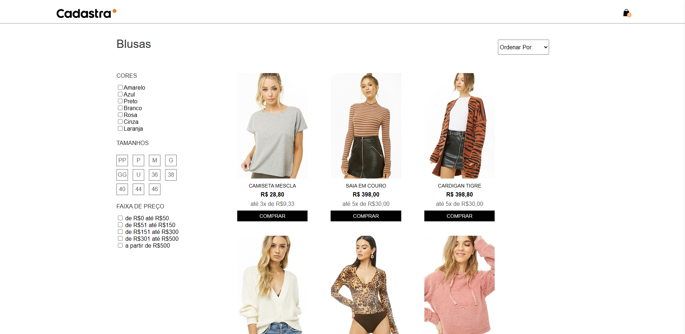
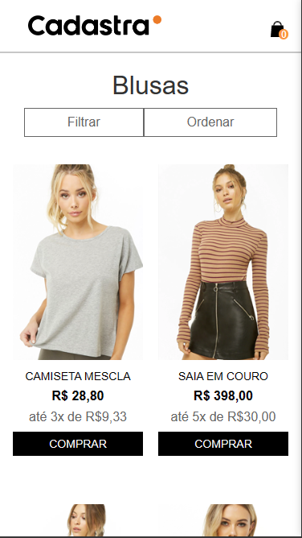

# Layout Cadastra

## 📝 Sobre o projeto
Este projeto se trata da realização de um desafio proposto pela empresa Cadastra, como parte de um processo seletivo. Ele consiste na criação de um site baseado no [Layout proposto](https://www.figma.com/file/Z5RCG3Ewzwm7XIPuhMUsBZ/Desafio-Cadastra?type=design&node-id=0%3A1&mode=design&t=A0G2fRjMSrcQjchw-1).

## ✍️ Descrição do desafio
O tema é uma pagina de categoria comumente usado em sites ecommerce, nessa página o dev deverá construir uma pagina de categoria mostrando os produtos em grid, um filtro funcional para filtragem dos produtos, ordenação dos produtos e adicionar um item no minicart quando clicado em comprar.

## ⚛️ Tecnologias utilizadas
- Typescript
- Sass
- Gulp

## 💽 Como rodar o projeto
Para iniciar o projeto localmente realize um clone do repositório:
```
git clone https://github.com/MatheusPano/desenvolvedor-cadastra.git
```

Para instalar as dependências do projeto:
```
npm install
```

Após instalado as dependências, para iniciar o projeto:
```
npm start
```

## 💻 Preview do projeto

### Desktop


### Mobile
